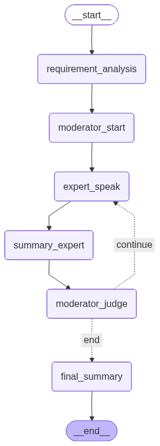

# graph_discussion

基于LangGraph实现的多智能体会议讨论系统，通过不同角色的智能体协作解决复杂问题。

## 架构图

系统使用状态图(StateGraph)构建智能体协作流程，各智能体按照预定义的路径进行交互和信息流转。



## 项目结构

```
graph_discussion/
├── __init__.py            # 包初始化文件
├── main.py                # 主程序入口
├── graph.py               # 图结构定义
├── state.py               # 状态管理
├── config.py              # 配置管理
├── agents/                # 智能体目录
│   ├── __init__.py
│   ├── base_agent.py      # 基础智能体类
│   ├── moderator.py       # 主持人智能体
│   ├── requirement_analyst.py # 需求分析智能体
│   ├── summary_expert.py  # 总结专家智能体
│   └── experts/           # 专业领域专家
│       ├── base_expert.py # 专家基础类
│       ├── tech_expert.py # 技术专家
│       ├── business_expert.py # 商业专家
│       └── research_expert.py # 研究专家
├── tools/                 # 工具目录
│   ├── __init__.py
│   ├── base_tool.py       # 基础工具类
│   ├── tool_registry.py   # 工具注册表
│   ├── web_search.py      # 网页搜索工具
│   └── rag_tool.py        # RAG检索工具
└── utils/                 # 工具函数
    ├── __init__.py
    └── logger.py          # 日志工具
```

## 智能体关系说明

系统包含以下核心智能体，它们通过状态图进行协作：

1. **需求分析师 (RequirementAnalyst)**
   - 负责分析用户输入，提取核心需求和讨论主题
   - 确定需要参与讨论的专家类型
   - 是整个流程的起点

2. **主持人 (Moderator)**
   - 协调讨论流程，组织会议进行
   - 生成讨论问题，引导专家发言
   - 判断讨论是否充分，决定是否继续

3. **领域专家**
   - **技术专家 (TechExpert)**: 提供技术可行性分析和实现方案
   - **商业专家 (BusinessExpert)**: 提供商业价值评估和市场策略
   - **研究专家 (ResearchExpert)**: 提供研究方向和学术视角
   - 所有专家均继承自BaseExpert，拥有工具使用能力

4. **总结专家 (SummaryExpert)**
   - 对每轮讨论进行总结，提炼关键点
   - 为最终决策提供支持

### 智能体交互流程

1. 用户输入问题或需求
2. 需求分析师分析需求，确定讨论主题和专家
3. 主持人召开会议，提出第一个讨论问题
4. 相关专家根据问题和历史上下文发言
5. 总结专家对本轮讨论进行总结
6. 主持人判断是否继续讨论
   - 如果继续，生成新问题并重复步骤4-6
   - 如果结束，进入最终总结
7. 生成最终总结报告和各专家落地方案

## 核心功能

### 1. 需求分析
自动分析用户输入，提取关键信息，确定讨论方向。

### 2. 多轮讨论
支持多轮深入讨论，每轮讨论都基于历史上下文进行。

### 3. 工具集成
专家智能体可以使用网页搜索和知识库检索工具获取额外信息。

### 4. 自动总结
对每轮讨论和整体会议进行智能总结，提炼关键结论。

### 5. 落地方案
为不同领域（技术、商业、研究）生成具体的落地方案。

## 技术栈

- Python 3.x
- LangGraph (状态图管理)
- LangChain-OpenAI (LLM交互)

## 使用说明

### 环境要求

1. 安装依赖：
```bash
pip install -r requirements.txt
```

2. 配置环境变量：
在项目根目录创建`.env`文件，包含以下内容：
```
OPENAI_API_KEY=your_openai_api_key
OPENAI_BASE_URL=https://api.openai.com/v1
```

### 运行程序

```bash
cd graph_discussion
python main.py
```

按照提示输入您的问题或需求，系统将自动启动多智能体讨论流程。

### 输出结果

程序将生成：
- 会议讨论过程记录
- 最终总结报告
- 各专家领域的落地方案
- 讨论流程图 (graph_discussion.png)

## 扩展指南

### 添加新专家

1. 在`agents/experts/`目录下创建新的专家类，继承自`BaseExpert`
2. 实现必要的`speak`方法
3. 在`graph.py`中注册新专家

### 添加新工具

1. 在`tools/`目录下创建新的工具类，继承自`BaseTool`
2. 实现必要的`execute`方法
3. 在相应的专家类中注册和使用新工具

## 注意事项

1. 确保设置了有效的OpenAI API密钥
2. 讨论轮次可通过`max_rounds`参数调整
3. 工具使用需要相应的配置和权限
4. 复杂问题可能需要多轮讨论才能得到充分解答